***Personal Project; Last Updated: September 17, 2021***

**Update**\
I'll be occasionally working on this to add more features in the future.

**Planned Feature**
- Adding pre-list saving and loading via .txt or .json format, so you can play your current favorite music without going back to that youtube playlist link.

# [Discord Bot] Paimon-chan #
A Discord bot with various functionalities I desired to have. 
<!--  -->

<!--  -->
<!--  -->

**Steps**
1. Make sure to have npm and nodeJS installed. 
2. Run "1 install_dependencies.bat". 
3. Copy your bot-token and put it inside '.\json_data\login_tokens.json'. 
4. Run '2 start.bat' or you can host it online with heroku/other servers. 
5. Finally, if you want music capabilities then please follow the instructions in 'README - Add music support.txt'. 

**Short list of bot-commands**
- [Help](#Help)
- [Music Support](#Music-Support)
- [Super Access Commands](#Super-Access-Commands)
- [Genshin Impact](#Genshin-Impact)
- [ETC](#Other-Commands)

| **Test me out!** 
| :---: 
| 

# Help #
Display a list of bot commands and its usage.

Example Usage |
| :---
?help

# Music Support #
Command | param | Description
| :--- | :--- | :---
?play \[string\] | Youtube-URL Keywords | Play music from youtube.
?playlocal \[string\] | Category | Play music from local_folder.
?musicinfo | N/A | Fetch details of current song.
?vol \[int?Optional\] | server.volume | Change the volume of the server's dispatcher.
?pause | N/A | Pause music from playing.
?resume | N/A | Resume current paused music.
?skip \[int?Optional\] | skipNum | Skip current \| skipNum of songs in queue.
?stop | N/A | Stop music and clear queue.
?loop \[string?Optional\]  | single \| list \| off | Music looping.
?queue \[int?Optional\]  | queue_display_size | Display current queue.
?shuffle | N/A | Shuffle queue.

**Paimon in action:**

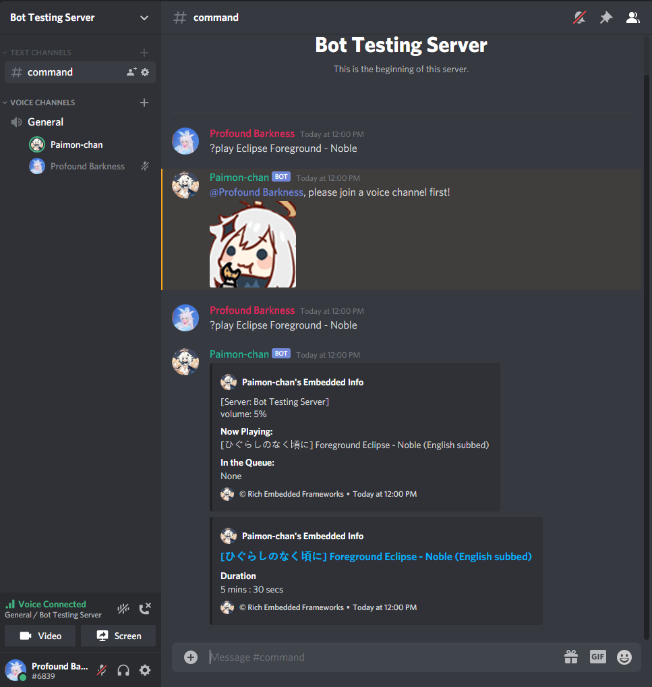 

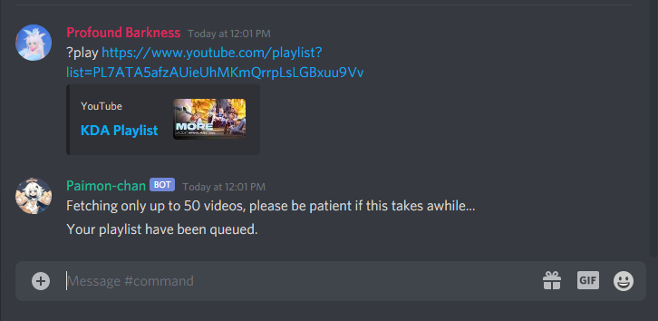 
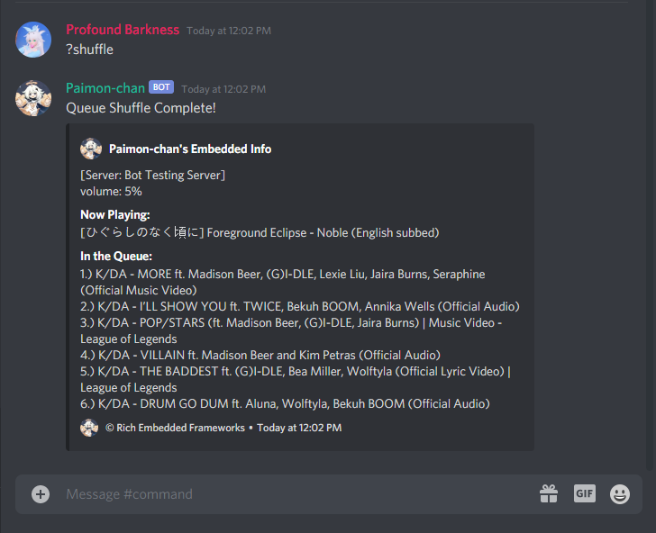 
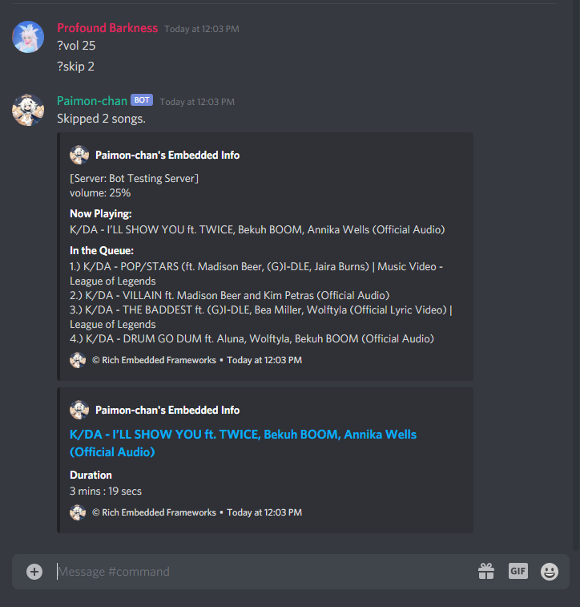 

# Super Access Commands #
Can be used if 'SuperAccess' is granted by the owner \| exisiting admin w/ 'SuperAcess'. 

Command | param | Description
| :--- | :--- | :---
?caching \[string?Optional\] | on \| off | Preload audio data into a file, then stream it (Lower stream-quality?).
?dlmusic | N/A | Download music from pre-cached music file.
?clean \[int?Optional\] | numLines | Clean channel messages.
?server | N/A | Request servers info that Paimon's currently running in.
?shutdown | N/A | Shutdown the bot from the server.
?add super \[param\] ?add superAccess \[param\] | @userTag | Add a specified user from SuperAccess-commands.
?remove super \[param\] ?remove superAccess \[param\] | @userTag | Remove a specified user from SuperAccess-commands.

**Audio Caching/Downloading:**

 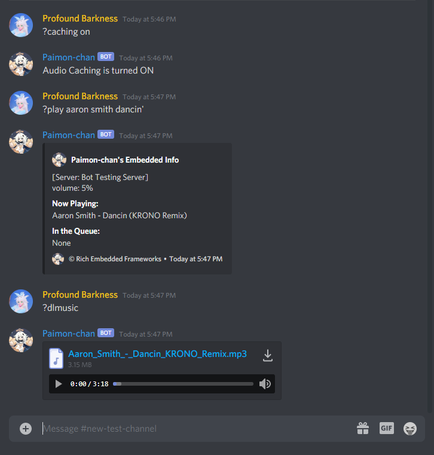

**Add new SuperAccess member:**

admins.json (Before) | admins.json (After)
| :---: | :---:
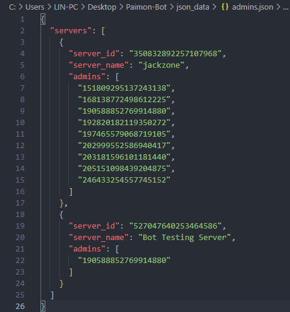 | 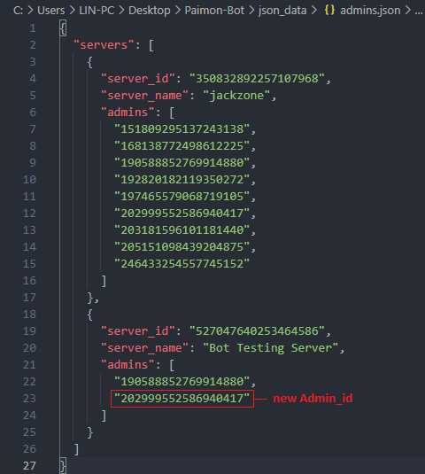
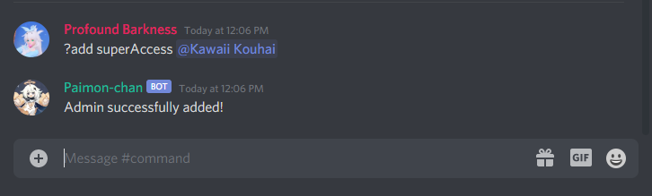

# Genshin Impact #
Command | bannerType | pityType | Operation | Description
| :--- | :--- | :--- | :--- | :---
?gfile | N/A | N/A | N/A | Request a raw .json of everyone's table.
?gcreate | N/A | N/A | N/A | Create a default Genshin Impact Gacha Table.
?gtable | N/A | N/A | N/A | Display the user's current Genshin Impact Gacha Table.
?gpity \[pityType: string?Optional\] | N/A | Normal Soft | N/A | Display the calculated wishes (or primogem) until your next 5-star pity item.
?gwish \[bannerType: string\] \[Operation\] \[int\] | Standard Weapon Event | N/A | Add Replace | Manually modify the specified count of bannerType in the user's Genshin Gacha Table.
?greset \[bannerType: string\] | Standard Weapon Event | N/A | N/A | Manually reset the specified count of bannerType in the user's Genshin Gacha Table.

**Test Run:**

 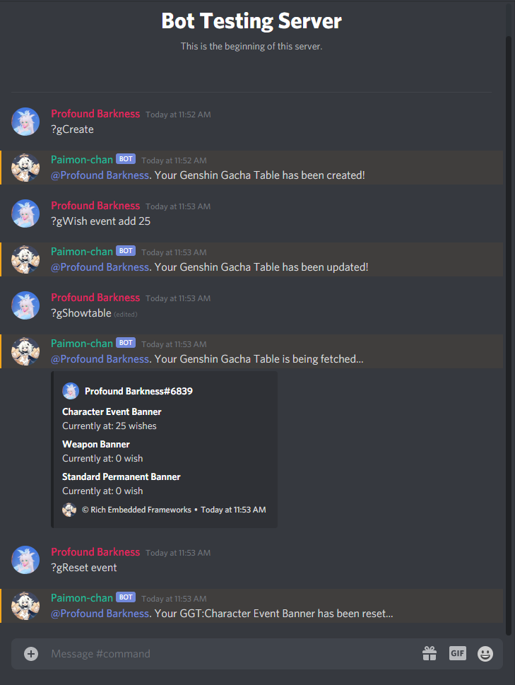 
 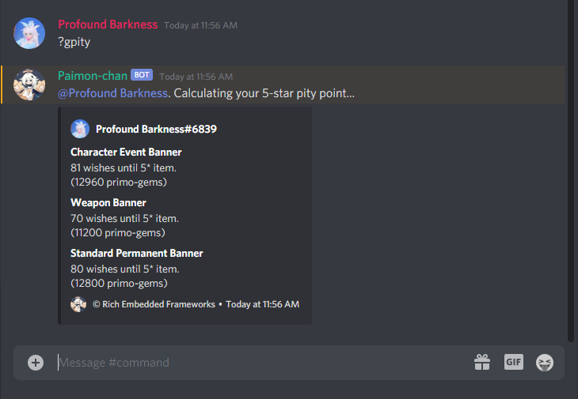 

# Other Commands #
Command | Description
| :--- | :---
?mapleStory | Give the user my maplestory guild page.
?roll | Roll two random numbers from 1-6 (Dice Function).

**Examples:**

 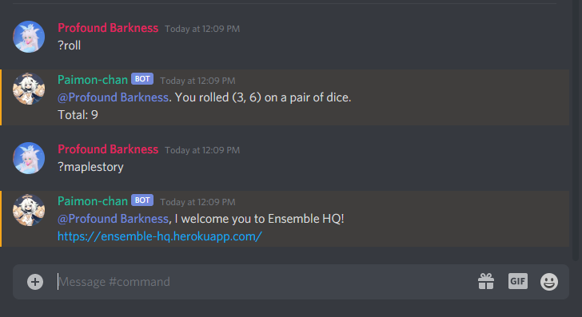 
